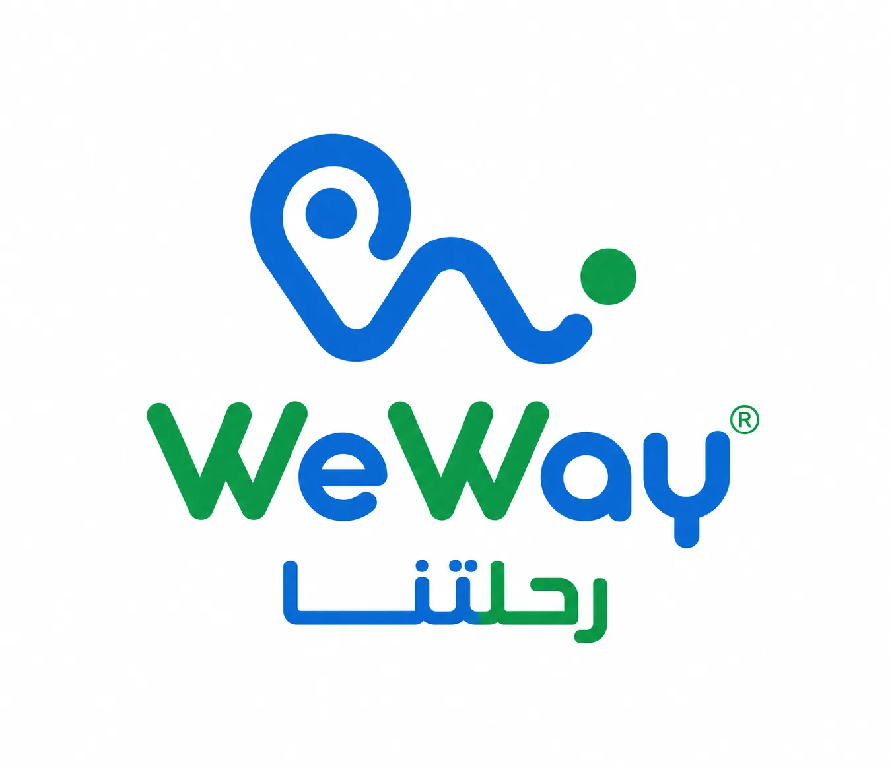

# WeWay

WeWay واجهة React لتطبيق تنظيم الرحلات الجماعية. تجمع الصفحة بين التخطيط، التتبع على الخريطة، المحفظة المشتركة، الدردشة، الذكريات، وعرض رحلات ملهمة للمستخدمين.



## المميزات

- تتبع مباشر لمسار الرحلة عبر خريطة OpenStreetMap.
- مميزات منظمة للرحلات الجماعية: خطط ذكية، دردشة، محفظة، مصاريف، تقارير، وذكريات مشتركة.
- قسم خطوات يشرح رحلة المستخدم من إنشاء الرحلة حتى الجدول المقترح.
- معرض رحلات تفاعلي مع نافذة تفاصيل قابلة للوصول بلوحة المفاتيح.
- دعم عربي/إنجليزي مع اتجاه RTL/LTR.
- صور مضغوطة WebP لتحسين حجم المشروع وسرعة التحميل.

## التشغيل محلياً

```bash
npm install
npm start
```

يفتح التطبيق عادة على:

```text
http://localhost:3000
```

## أوامر مفيدة

```bash
npm run build
npm test
```

## بنية مهمة

- `src/components`: مكونات الواجهة.
- `src/styles`: ملفات CSS مقسمة حسب الأقسام والمكونات.
- `src/data/siteData.js`: نصوص الصفحة وبيانات الرحلات.
- `src/img`: صور التطبيق بصيغ مضغوطة.
